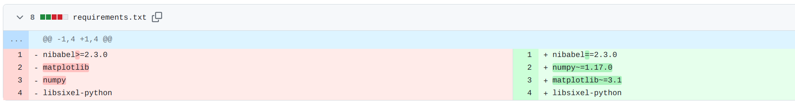

# niicat: A fork version supports multiple image protocol, like ascii, sixel, iterm and kitty.

> NOTE:
>
> The original niicat integrates the sixel protocol, but I use kitty terminal, which doesn't support sixel. So I created this fork.
>
> This fork version only convert nifti file to png, jpg, or any image format you want, and you can use other external image preview cli tools to display the images.
>
> The gif below is the offical verion. The fork version usage is different (more simple I think).


This is a tool to help you convert the nifti to png or jpg, and you can use external cli tools to quickly preview nifti images on the terminal.
This can be helpful if you are working on a remote server via SSH and do not have a -X connection.

## Install:

```bash
# If you have installed the offical version,
# you should uninstall it first to prevent conflicts.
# pip uninstall niicat

cd ~  # You can choose other destination folder.

# Clone the forked version repo.
git clone https://github.com/ysl2/niicat.git

# Install dependencies
cd niicat
pip install -r requirements.txt

# Then, add The executable file path into $PATH
export PATH=~/niicat/bin:$PATH

# If you want to permanently add it to $PATH,
# you should write the code above into `~/.bashrc`,
# and run `source ~/.bashrc` to refresh the config.
```

## Usage:

> NOTE: The gif above is the offical niicat usage, it doesn't suit the fork version. Please refer the steps below.

1. Convert the nii file to png or jpg or other format.

    ```bash
    # niicat [input nii] [output destination]
    niicat T1.nii.gz /tmp/T1.png
    ```

2. Then, you can use any terminal cli tools to show the output image in terminal.

    ```bash
    # For example, you can use chafa.
    # It support multiple image protocol like ascii, sixel, iterm, kitty.

    # for ascii format
    chafa -f symbols /tmp/T1.png

    # for sixel format
    # NOTE: Your terminal must support sixel image protocol.
    # You can check the link below to confirm if your terminal supports it.
    # https://www.arewesixelyet.com/
    chafa -f sixels /tmp/T1.png
    # Both `sixels` or `sixel` are ok here, I don't know why,
    # but the offical command flag is `sixels`.

    # for kitty format
    # Only works when you are using kitty terminal.
    chafa -f kitty /tmp/T1.png

    # for iterm format
    # I don't use iterm so I'm not sure if this must in iterm.
    chafa -f iterm /tmp/T1.png
    ```

3. You can write a script to automatically run the steps above, but this is not the goal of the fork project. This fork only aims to convet the nifti to common image, and the preview task is finished by other tools, for example, `chafa`, `viu`, `timg`, `img2sixel`, etc.

    ```bash
    # For example, you can write a script called `myniicat`,
    # And you should `chmod 777 myniicat` to give it executable permission.
    # You can use it like: `myniicat T1.nii.gz`, and the image will be drawn in your terminal.
    # Script contents below:

    #!/bin/bash

    # Define the temp image output destination. "$1" is the first arguments: `T1.nii.gz`.
    TMPFILE=/tmp/"$1".png  # T1.nii.gz.png
    # If the temp image not exists, create it by niicat.
    if [[ ! -e "$TMPFILE" ]]; then
      niicat "$1" "$TMPFILE"
    fi
    # For sixel format output
    chafa -f sixels "$TMPFILE"
    ```

## Possible problems

Niicat was only tested on python >= 3.5.

If you encounter any dependencies problem, you can refer the commit content from [here](https://github.com/MIC-DKFZ/niicat/compare/master...ostfor:niicat:fix/update-requirenments), but I didn't test it.



## Copyright

Thanks to the original authors for awesome work!

Copyright © German Cancer Research Center (DKFZ), Division of Medical Image Computing (MIC).
Please make sure that your usage of this code is in compliance with the [code license](LICENSE).
